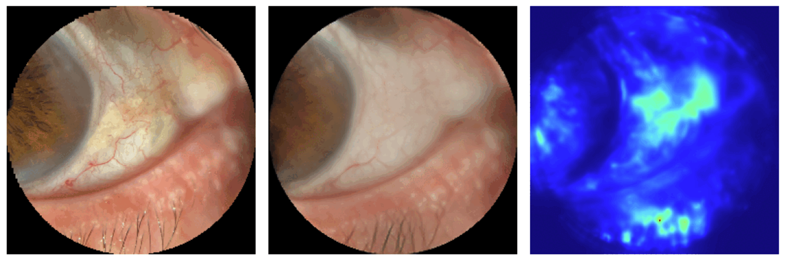

# AnoSiamAE
An anomaly detection model for anterior eye segment leveraging Self-Supervised Siamese Autoencoders. Code soumission for the 12th OMIA workshop on MICCAI 2025.



# Installation guidelines

## Requirements

This repo was build upon python 3.9 and all dependencies are given in the requirements.txt file.

```bash
  pip install -r requirements.txt
```
## Datasets

We used the [RFMiD](https://ieee-dataport.org/open-access/retinal-fundus-multi-disease-image-dataset-rfmid) dataset, a public collection of 3,200 retinal fundus images
annotated with 46 pathologies. It includes 1,920 training images (of which only
the 400 normal images are used for training), and 640 images each for validation
and testing.

After installing the RFMiD dataset, make sure it follows the adequate folder structure:

```
RFMiD  
|-> Training
|   |-> XXX.png
|   |-> ...
|-> Validation
|    |-> XXX.png
|   |-> ...
|-> Test
|   |-> XXX.png
|   |-> ...
|-> RFMiD_Testing_Labels.csv
|-> RFMiD_Training_Labels.csv
|-> RFMiD_Validation_Labels.csv
```

By default, the path to the RFMiD dataset is set to
```python
RFMiD = "/store/data/RFMiD"
```
in the src/utils/constant.py file. Make sure to use the right path according to your dataset installation location. Custom dataset can be used by adding a new dataloaders (src/data/dataloader.py) and datasets (src/data/datasets.py) in their corresponding file. Make sure to follow the same structure as the examples given for the proposed RFMiD dataloaders, and by adding them in the DATALOADER_REGISTRY. Path to the new dataset can be added in the src/data/access_data.py file. 

## Preprocessing

Data are preprocessed to remove the background and only keep the ROI using domain-specific hyperparameters. Make sure these parameters work with your input data. (src/data/transform/preprocess.py)

# Run training

## Configuration files

Specific configuration of all baselines models are given in the configuration folder:

```
config
|-> ae_mae.yaml
|-> ae_ssim.yaml
|-> anovaegan.yaml
|-> beta_vae.yaml
|-> dae.yaml
|-> dpae.yaml
|-> draem.yaml
|-> ganomaly.yaml
|-> siamae.yaml
```

Global training and evaluation configuration parameters, including data augmentations and system parameters, are set in the src/config/config.py file.

## Training 

Models can be trained using the main.py script following the given prompt:

```bash
python main.py --cfg_path /path/to/cfg.yaml 
```

Afterwards, training will start and a folder in output/default/model_name will be created, where logs, visulization steps and model weights will be saved.

Several flag options are made available for training:
```bash
--cfg_path (str): Path to model configuration file
--ckpt_path (str): Path to model checkpoint path (continue training from saved checkpoint)
--folder (str): Path to model output folder (continue training from saved output model)
--output (str): Override configuration output path to the given path
--data (str): Data name (default:rfmid)
--device (str): cuda/cpu (default:cuda)
--batch_size (int):Number of samples per batch
```

## Evaluation

Models can be tested using one of the following prompts:

```bash
python main.py --cfg_path /path/to/cfg.yaml --ckpt /path/to/checkpoint.pth --test_only
```
```bash
python main.py --folder /path/to/model/output/folder --test_only
```
